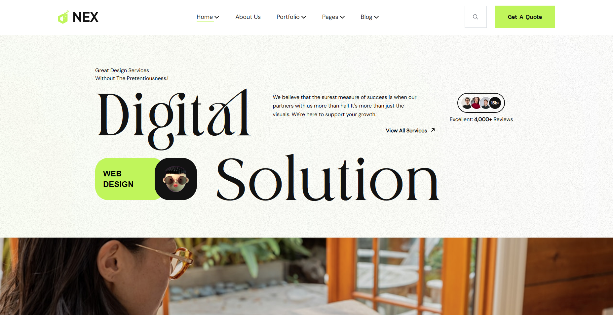

# Desafio Front-End Noweb - Digital Solution

Este projeto foi desenvolvido como parte do processo seletivo para a vaga de Desenvolvedor Front-End na Noweb. O objetivo foi replicar uma landing page a partir de um design no Figma, garantindo fidelidade visual, responsividade e a implementação de uma funcionalidade adicional de busca de CEP com integração a uma API externa.

## ✨ Funcionalidades

- **Layout Fiel ao Figma:** A interface foi construída seguindo as especificações de design, incluindo espaçamentos, tipografia e disposição dos elementos.
- **Responsividade:** O layout é totalmente adaptável para dispositivos móveis, mesmo sem um design mobile de referência.
- **Modal de Busca de CEP:** Ao clicar no ícone de busca no cabeçalho, um modal é aberto para a consulta de CEP.
- **Integração com ViaCEP:** O modal consome a API pública do [ViaCEP](https://viacep.com.br/) para buscar dados de endereço.
- **Validação e Formatação:** O campo aceita CEPs com ou sem formatação (hífen) e valida se o CEP possui 8 dígitos.
- **Preenchimento Automático:** Os campos de Logradouro, Bairro, Complemento, Cidade e Estado são preenchidos automaticamente com os dados da API.
- **Campos Bloqueados:** Após a consulta, os campos de endereço são bloqueados para edição, conforme solicitado.

## 🛠️ Tecnologias Utilizadas

O projeto foi desenvolvido utilizando a seguinte stack:

- **[React](https://react.dev/)**
- **[TypeScript](https://www.typescriptlang.org/)**
- **[Vite](https://vitejs.dev/)**
- **[Tailwind CSS](https://tailwindcss.com/)**
- **[pnpm](https://pnpm.io/)** como gerenciador de pacotes

## 🔗 Link da Aplicação

O projeto está hospedado na Vercel e pode ser acessado através do link abaixo:

**[Clique aqui para acessar a demonstração ao vivo](https://seu-link-aqui.vercel.app)** _(Substitua pelo seu link da Vercel após o deploy)_

## 🏁 Começando

Para rodar este projeto localmente, siga os passos abaixo.

### Pré-requisitos

Antes de começar, você vai precisar ter instalado em sua máquina as seguintes ferramentas:

- [Node.js](https://nodejs.org/en) (Recomendado versão LTS)
- [pnpm](https://pnpm.io/installation) (Pode ser instalado globalmente com `npm install -g pnpm`)
- [Git](https://git-scm.com/)

### Instalação

1.  Clone o repositório:

    ```bash
    git clone [https://github.com/seu-usuario/digital-solution.git](https://github.com/seu-usuario/digital-solution.git)
    ```

2.  Navegue até o diretório do projeto:

    ```bash
    cd digital-solution
    ```

3.  Instale as dependências com o pnpm:
    ```bash
    pnpm install
    ```

## 🚀 Rodando o Projeto

Após a instalação das dependências, você pode iniciar o servidor de desenvolvimento local:

```bash
pnpm dev
```

O servidor será iniciado, e a aplicação estará disponível em **`http://localhost:5173`** (ou outra porta, caso a 5173 esteja em uso).

## 🏗️ Build

Para gerar a versão de produção otimizada do projeto, execute o comando:

```bash
pnpm build
```

Este comando irá compilar o código TypeScript e gerar os arquivos estáticos no diretório `dist/`, prontos para o deploy.

## 📂 Estrutura de Pastas

O projeto está organizado da seguinte forma para facilitar a manutenção e escalabilidade:

```
digital-solution/
├── public/              # Arquivos estáticos e fontes
├── src/
│   ├── assets/          # Imagens, SVGs e outros recursos
│   ├── components/      # Componentes React reutilizáveis
│   │   ├── cep/
│   │   ├── footer/
│   │   ├── header/
│   │   └── ...
│   ├── pages/           # Componentes que representam as páginas
│   │   └── home/
│   ├── styles/          # Arquivos de estilo globais e fontes
│   ├── App.tsx          # Componente principal que gerencia as rotas
│   └── main.tsx         # Ponto de entrada da aplicação
├── package.json
└── README.md
```
